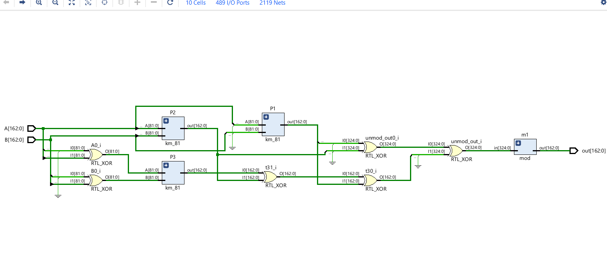
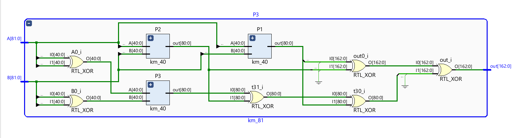
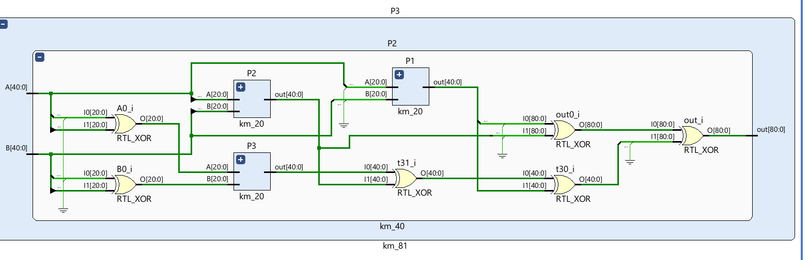
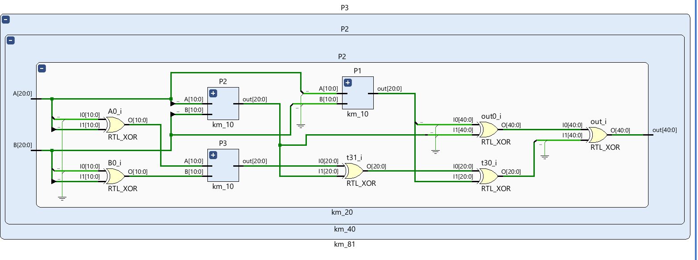
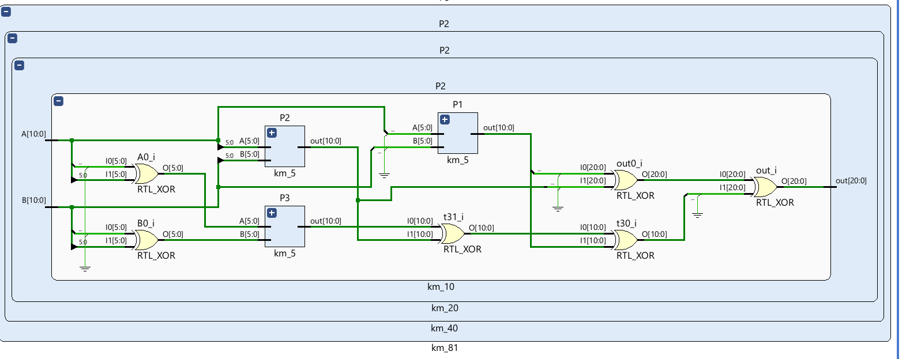
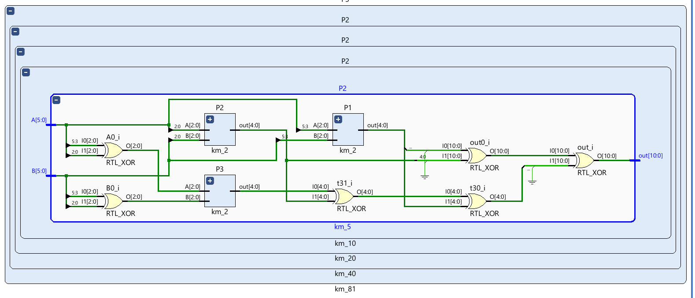
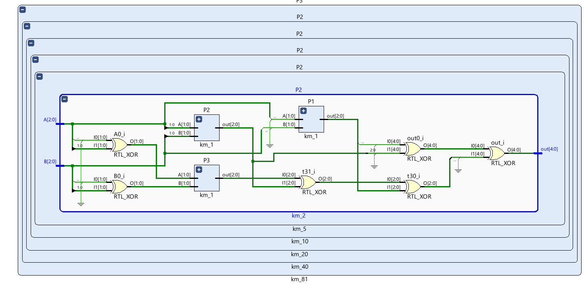
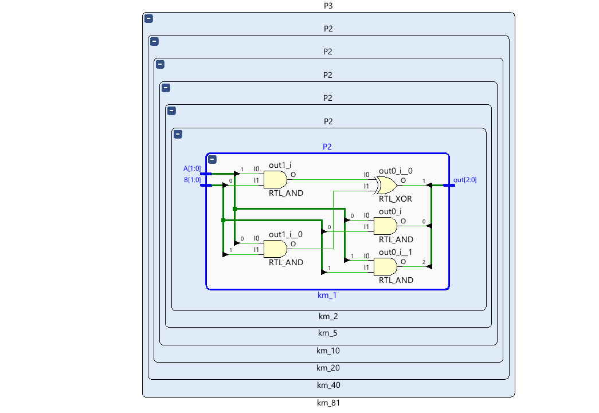
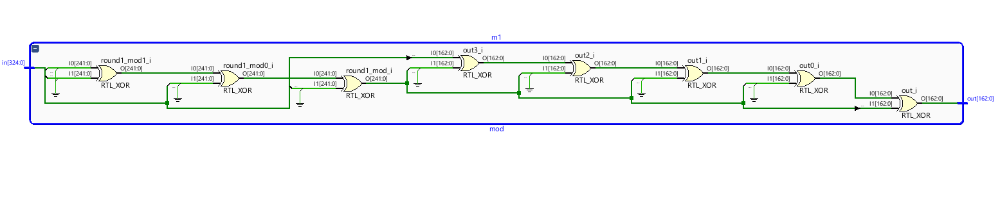
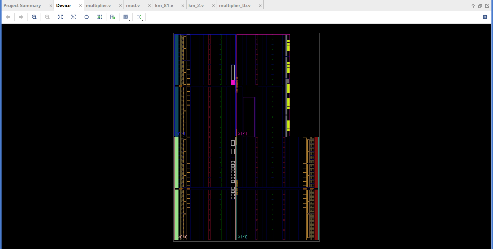

# Karatsuba Multiplier for GF(2^163)

I am Aditya Ranjan Jha,20EE10006. This is my assingment submission for karatsuba multiplier for GF(2^163)
This multiplier is synthesizable and can be implemented on FPGAs with atleast 489 I/O ports. From VIVADO ISE I have generated schematic for my design and also verified if it is synthesizable. To run model just for verification of output you can run the bash script on your linux shell if you have `iverilog` installed 

```bash
./run.sh
```

The output is saved in result.out

Here Are the block diagrams for various components of the device generated from the synthesized design on VIVADO ISE.

1. Karatsuba Multiplier GF(2^163)
    

2. Karatsuba Multiplier GF(2^82)
    

3. Karatsuba Multiplier GF(2^41)
    

4. Karatsuba Multiplier GF(2^21)
    

5. Karatsuba Multiplier GF(2^11)
    

6. Karatsuba Multiplier GF(2^6)
    

7. Karatsuba Multiplier GF(2^3)
    

8. Karatsuba Multiplier GF(2^2)
    

9. Modulus for GF(2^163)
    
    
The Synthesized Device:
